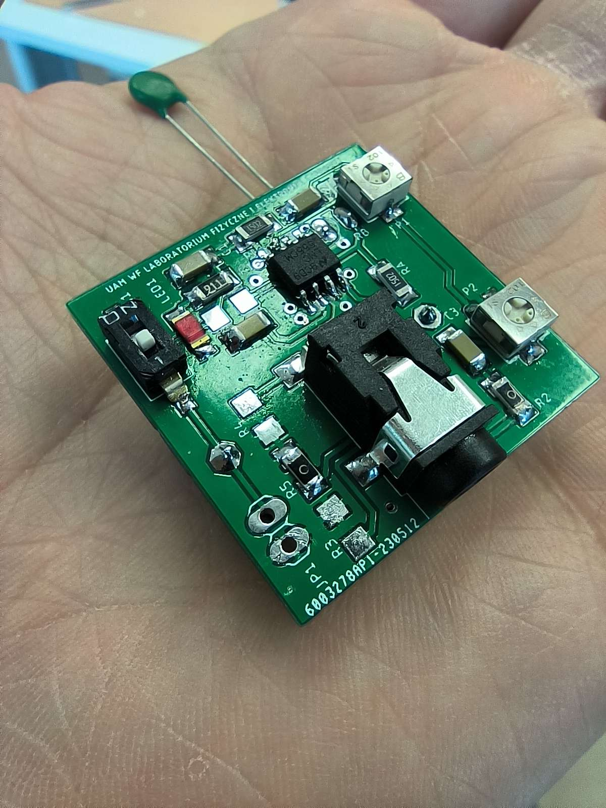
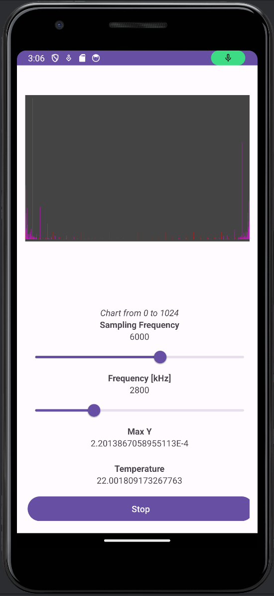

# About
This project is a temperature monitoring application developed using Java. The application records audio data and uses Fast Fourier Transform (FFT) to calculate the amplitude of the signal. This amplitude is then used to calculate the temperature.
The audio input is generated by a self-made PCB connected to the device's audio jack. The application allows users to adjust the frequency and sampling rate of the audio signal and provides a visual representation of the amplitude of the signal.
# Features
- **Real-time Temperature Monitoring**: The application provides real-time temperature monitoring by calculating the amplitude of the audio signal.
- **Frequency and Sampling Adjustment**: The application allows users to adjust the frequency and sampling rate of the audio signal.
- **Visual Representation**: The application provides a visual representation of the amplitude of the audio signal.
- **Thread Synchronization**: The application uses thread synchronization to ensure that the UI and audio recording threads work in harmony.

# PCB and Application Preview

# Getting Started
To get started with this project, follow these steps:

1. **Clone the Repository**: Clone the repository to your local machine using the command `git clone <repository-url>`.
2. **Open the Project**: Open the project in Android Studio Iguana | 2023.2.1 Patch 1 or any other IDE that supports Java and Kotlin development.
3. **Build the Project**: Build the project by clicking on `Build -> Build Project` in the IDE.
4. **Run the Application**: Run the application on an emulator or a physical device by clicking on `Run -> Run 'app'`.

Please note that you need to have the Android SDK and other necessary build tools installed on your machine to build and run the application.